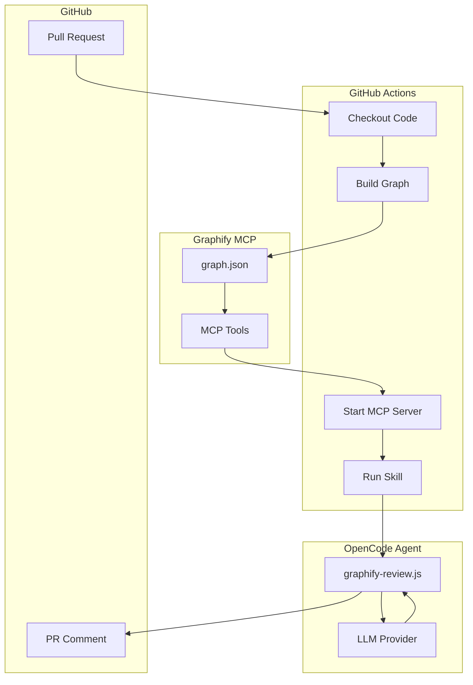

# GraphiView

> **Pre-merge architectural review using Graphify knowledge graphs**

[](https://github.com/your-org/graphiview/actions/workflows/graphify-review.yml)
[](https://opensource.org/licenses/MIT)

---

## What is GraphiView?

GraphiView automatically analyzes your pull requests for **architectural risks** before they merge. It uses Graphify's knowledge graphs to detect:

| Risk Type | Description | Example |
|-----------|-------------|---------|
| **Blast Radius** | How many nodes are affected by changes | Changing `auth.py` affects 47 files |
| **God Nodes** | High-centrality files that need extra scrutiny | `utils.js` has betweenness centrality > 0.70 |
| **Community Sprawl** | Changes spread across too many modules | PR touches UI, DB, and Analytics |
| **Circular Dependencies** | New cycles introduced | A → B → C → A |
| **Layering Violations** | Cross-layer coupling | UI directly imports from DB |

---

## Quick Start

Get started in 5 minutes:

### 1. Add workflow file

```bash
mkdir -p .github/workflows
cp .github/workflows/graphify-review.yml your-repo/.github/workflows/
```

### 2. Add OpenCode configuration

```bash
cp -r .opencode your-repo/
```

### 3. Set required variable

In your repository settings (Settings → Secrets and variables → Actions):

- `OPENCODE_GATEWAY_AUDIENCE` = your organization's OpenCode gateway URL

### 4. Create a PR

The review will appear automatically! 🎉

📖 **[Full Quick Start Guide](docs/QUICKSTART.md)**

---

## How It Works



1. **PR Created** → GitHub Actions triggers
2. **Build Graph** → Graphify extracts code structure
3. **MCP Server** → Exposes graph tools
4. **Skill Runs** → Analyzes architectural impact
5. **LLM Generates** → Creates human-readable report
6. **PR Comment** → Posted automatically

---

## Example Output

```markdown
## 📊 GraphiView Architectural Review

**Overall risk:** 🟡 **MEDIUM** (score: 0.45)

### Key Findings

- ⚠️ **Moderate blast radius:** 12 nodes affected
- 🔴 **God nodes modified:** `auth.py` - requires careful review
- 📊 **Moderate sprawl:** Changes touch 2 communities
- ✅ **No circular dependencies introduced**
- ✅ **No layering violations**

### Recommendations

- ⚠️ **Extra review required for god node modifications**
- ✅ **Add tests for affected areas**

---
*Generated by GraphiView*
```

---

## Configuration

### Risk Thresholds

Customize in `.opencode/opencode.json`:

```json
{
  "graphifyReview": {
    "riskThresholds": {
      "low": 0.3,
      "medium": 0.6,
      "high": 1.0
    },
    "godNodeThreshold": 0.70,
    "sprawlThreshold": 3,
    "blastRadiusThreshold": 15
  }
}
```

### LLM Providers

Supports multiple LLM providers:

| Provider | Environment Variable |
|----------|---------------------|
| OpenAI | `OPENAI_API_KEY` |
| Anthropic | `ANTHROPIC_API_KEY` |
| Gemini | `GEMINI_API_KEY` |
| Custom | `OPENAI_BASE_URL` + `OPENAI_API_KEY` |

---

## Project Structure

```
graphiview/
├── .github/
│   └── workflows/
│       └── graphify-review.yml    # GitHub Actions workflow
├── .opencode/
│   ├── opencode.json              # OpenCode configuration
│   └── plugins/
│       └── graphify-review.js     # Skill file
├── docs/
│   ├── QUICKSTART.md              # Quick start guide
│   ├── ARCHITECTURE.md            # Architecture documentation
│   ├── PROBLEM_STATEMENT.md       # Problem we're solving
│   ├── SOLUTION.md                # Our solution
│   └── graphifysetup/
│       └── graphifyinstall.md     # Graphify setup guide
├── plans/
│   └── IMPLEMENTATION_PLAN.md     # Detailed implementation plan
└── README.md                      # This file
```

---

## Documentation

| Document | Description |
|----------|-------------|
| [Quick Start](docs/QUICKSTART.md) | Get started in 5 minutes |
| [Implementation Plan](plans/IMPLEMENTATION_PLAN.md) | Detailed architecture and implementation |
| [Architecture](docs/ARCHITECTURE.md) | System architecture |
| [Problem Statement](docs/PROBLEM_STATEMENT.md) | The problem we're solving |
| [Solution](docs/SOLUTION.md) | Our solution approach |
| [Graphify Setup](docs/graphifysetup/graphifyinstall.md) | How to set up Graphify |

---

## Requirements

- GitHub repository with Actions enabled
- `OPENCODE_GATEWAY_AUDIENCE` variable set
- (Optional) LLM API key for graph enrichment

---

## Contributing

Contributions are welcome! Please:

1. Fork the repository
2. Create a feature branch
3. Make your changes
4. Submit a pull request

---

## License

MIT License - see [LICENSE](LICENSE) for details.

---

## Acknowledgments

- [Graphify](https://github.com/safishamsi/graphify) - Knowledge graph extraction
- [OpenCode](https://opencode.ai) - AI agent platform
- [ADORSYS-GIS/ai-governance](https://github.com/ADORSYS-GIS/ai-governance) - Reusable workflow