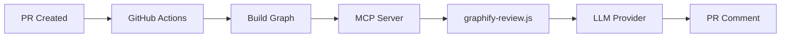

# GraphiView Quick Start Guide

> **Pre-merge architectural review using Graphify knowledge graphs**

---

## What is GraphiView?

GraphiView automatically analyzes your pull requests for architectural risks before they merge:

- 🟢 **Low Risk** - Safe to merge
- 🟡 **Medium Risk** - Review recommended
- 🔴 **High Risk** - Requires approval

It detects:
- **Blast radius** - How many nodes are affected
- **God nodes** - High-centrality files that need extra scrutiny
- **Community sprawl** - Changes spread across too many modules
- **Circular dependencies** - New cycles introduced
- **Layering violations** - Cross-layer coupling (e.g., UI → DB)

---

## Quick Setup (5 minutes)

### 1. Add the workflow file

Copy [`.github/workflows/graphify-review.yml`](../.github/workflows/graphify-review.yml) to your repository.

### 2. Add the OpenCode configuration

Copy [`.opencode/`](../.opencode/) directory to your repository:

```
.opencode/
├── opencode.json          # Configuration
└── plugins/
    └── graphify-review.js # Skill file
```

### 3. Set required variables

In your repository settings (Settings → Secrets and variables → Actions):

**Required:**
- `OPENCODE_GATEWAY_AUDIENCE` - Set this to your organization's OpenCode gateway URL

**Optional (for graph enrichment):**
- `GRAPHIFY_LLM_API_KEY` - API key for Graphify's LLM (if using docs/images)
- `GRAPHIFY_LLM_PROVIDER` - JSON config for custom LLM provider

### 4. Create a PR and watch the magic! 🎉

The review will appear automatically on your PR.

---

## How It Works



1. **PR Created** - GitHub Actions triggers the workflow
2. **Build Graph** - Graphify builds a knowledge graph from your code
3. **MCP Server** - Starts and exposes graph tools
4. **Skill Executes** - Calls Graphify MCP tools for analysis
5. **LLM Generates** - Creates human-readable report
6. **PR Comment** - Posted automatically

---

## Configuration

### Risk Thresholds

Edit `.opencode/opencode.json` to customize:

```json
{
  "graphifyReview": {
    "riskThresholds": {
      "low": 0.3,
      "medium": 0.6,
      "high": 1.0
    },
    "godNodeThreshold": 0.70,
    "sprawlThreshold": 3,
    "blastRadiusThreshold": 15
  }
}
```

### LLM Providers

GraphiView supports multiple LLM providers for generating reports:

| Provider | Environment Variable | Notes |
|----------|---------------------|-------|
| OpenAI | `OPENAI_API_KEY` | Default |
| Anthropic | `ANTHROPIC_API_KEY` | Claude models |
| Gemini | `GEMINI_API_KEY` | Google's models |
| Custom | `OPENAI_BASE_URL` + `OPENAI_API_KEY` | OpenAI-compatible endpoints |

Set these in your repository secrets.

---

## Custom LLM Provider for Graphify

If you want Graphify to enrich the graph with docs/images using a custom LLM:

### Step 1: Create provider config

```json
{
  "name": "kivoyo",
  "base_url": "https://api.kivoyo.com/v1",
  "model": "claude-3-opus",
  "env_key": "OPENAI_API_KEY"
}
```

### Step 2: Set secrets

In your repository settings:

- `GRAPHIFY_LLM_PROVIDER` = `{"name":"kivoyo","base_url":"https://api.kivoyo.com/v1","model":"claude-3-opus","env_key":"OPENAI_API_KEY"}`
- `GRAPHIFY_LLM_API_KEY` = `your-api-key`

### Step 3: Update workflow

The workflow already handles this! It will automatically register the custom provider before building the graph.

---

## Manual Trigger

You can also trigger a review manually by commenting on a PR:

```
/graphify review
```

---

## Example Output

```markdown
## 📊 GraphiView Architectural Review

**Overall risk:** 🟡 **MEDIUM** (score: 0.45)

### Key Findings

- ⚠️ **Moderate blast radius:** 12 nodes affected
- 🔴 **God nodes modified:** `auth.py` - requires careful review
- 📊 **Moderate sprawl:** Changes touch 2 communities
- ✅ **No circular dependencies introduced**
- ✅ **No layering violations**

### Recommendations

- ⚠️ **Extra review required for god node modifications**
- ✅ **Add tests for affected areas**

---
*Generated by [GraphiView](https://github.com/your-org/graphiview)*
```

---

## Troubleshooting

### "Graph file not found"

**Cause:** The graph wasn't built before OpenCode started.

**Solution:** Ensure the workflow has a `pre-steps` section that runs `graphify update .` before OpenCode starts.

### "MCP server not found"

**Cause:** Graphify MCP server isn't installed.

**Solution:** Add `pip install "graphifyy[mcp,pdf]"` to your workflow.

### "No LLM API key found"

**Cause:** Missing LLM provider configuration.

**Solution:** Set `OPENAI_API_KEY` or other provider keys in repository secrets.

### "OPENCODE_GATEWAY_AUDIENCE not set"

**Cause:** Required variable not configured.

**Solution:** Set `OPENCODE_GATEWAY_AUDIENCE` in repository variables (Settings → Secrets and variables → Actions → Variables).

---

## Architecture

See [IMPLEMENTATION_PLAN.md](../plans/IMPLEMENTATION_PLAN.md) for detailed architecture documentation.

---

## Contributing

Contributions are welcome! Please read our contributing guidelines.

---

## License

MIT License - see [LICENSE](../LICENSE) for details.