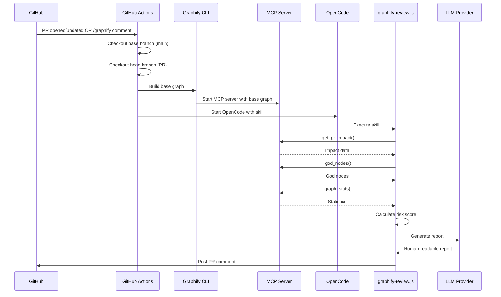
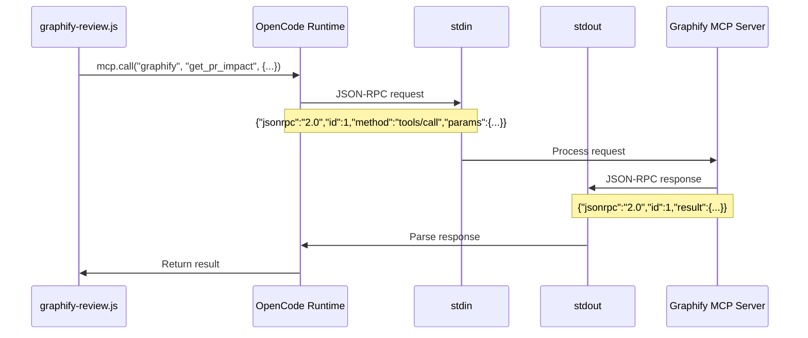

# GraphiView Implementation Plan

> **How to Build the Pre-Merge Architectural Review System**

---

## Overview

This document explains exactly how to build GraphiView - a system that performs **pre-merge architectural analysis** on pull requests using Graphify's knowledge graphs and OpenCode AI agent.

**Key Insight:** We leverage existing infrastructure:
- **Graphify (Python):** Already provides graph building and MCP server
- **OpenCode:** Already has MCP client, LLM integration, and GitHub API access
- **We only build:** A skill file that orchestrates the analysis

**Technology Stack:**
- **Graphify (Python):** Graph building and MCP tools (already exists)
- **OpenCode:** AI agent with MCP client and LLM integration (already exists)
- **Skill File (JavaScript):** Orchestrates analysis and generates reports (we build this)

---

## System Architecture

```mermaid
flowchart TB
    subgraph GitHub
        PR[Pull Request Created]
        Comment[/graphify review Comment]
        PRComment[PR Comment Posted]
    end

    subgraph GitHubActions[GitHub Actions]
        Workflow[opencode.yml]
        Checkout[Checkout Code]
        BuildGraph[Build Graphs]
    end

    subgraph OpenCodeLayer[OpenCode Agent]
        Skill[graphify-review.js Skill]
        MCpClient[MCP Client - Built-in]
        LLM[LLM Provider - Built-in]
        GitHubAPI[GitHub API - Built-in]
    end

    subgraph GraphifyLayer[Graphify MCP Server]
        Tools[MCP Tools]
        GraphJSON[graph.json]
    end

    PR --> Workflow
    Comment --> Workflow
    Workflow --> Checkout
    Checkout --> BuildGraph
    BuildGraph --> GraphJSON
    GraphJSON --> Tools
    Workflow --> Skill
    Skill --> MCpClient
    MCpClient --> Tools
    Skill --> LLM
    LLM --> Skill
    Skill --> GitHubAPI
    GitHubAPI --> PRComment
```

---

## How It Works

### Trigger Flow



### What Each Component Does

| Component | Role | Built? |
|-----------|------|--------|
| **Graphify CLI** | Build knowledge graphs from code | ✅ Already exists |
| **Graphify MCP Server** | Expose graph tools via MCP | ✅ Already exists |
| **OpenCode** | AI agent with MCP client and LLM | ✅ Already exists |
| **GitHub Actions Workflow** | Trigger analysis on PR events | ✅ Already exists (opencode.yml) |
| **graphify-review.js Skill** | Orchestrate analysis and generate report | ❌ We build this |

---

## What We Build: The Skill File

### File Location

```
.opencode/
├── opencode.json          # Configuration (already exists)
└── plugins/
    └── graphify-review.js  # We create this
```

### Skill File Structure

```javascript
// .opencode/plugins/graphify-review.js

/**
 * GraphiView Pre-Merge Architectural Review Skill
 * 
 * This skill orchestrates Graphify MCP tools to analyze PRs
 * and generates human-readable architectural review comments.
 */

module.exports = {
  name: "graphify-review",
  version: "1.0.0",
  description: "Pre-merge architectural review using Graphify knowledge graphs",
  
  // Triggers: When to run this skill
  triggers: [
    {
      event: "pull_request",
      actions: ["opened", "synchronize", "reopened"]
    },
    {
      event: "issue_comment",
      pattern: "^/graphify\\s+review"
    }
  ],
  
  // Configuration
  config: {
    // Risk thresholds
    riskThresholds: {
      low: 0.3,
      medium: 0.6,
      high: 1.0
    },
    // God node threshold (betweenness centrality)
    godNodeThreshold: 0.70,
    // Community sprawl threshold
    sprawlThreshold: 3,
    // Blast radius threshold
    blastRadiusThreshold: 15
  },
  
  // Main execution function
  async execute(context) {
    const { github, mcp, llm, payload, repo } = context;
    
    // 1. Get PR information
    const prNumber = payload.pull_request?.number || payload.issue?.number;
    const pr = await github.pulls.get({
      owner: repo.owner,
      repo: repo.repo,
      pull_number: prNumber
    });
    
    // 2. Get changed files
    const changedFiles = await github.pulls.listFiles({
      owner: repo.owner,
      repo: repo.repo,
      pull_number: prNumber
    });
    
    // 3. Call Graphify MCP tools
    const analysis = await analyzeWithGraphify(mcp, changedFiles);
    
    // 4. Calculate risk score
    const risk = calculateRisk(analysis, this.config);
    
    // 5. Generate report using LLM
    const report = await generateReport(llm, analysis, risk);
    
    // 6. Post PR comment
    await github.issues.createComment({
      owner: repo.owner,
      repo: repo.repo,
      issue_number: prNumber,
      body: report
    });
    
    return { success: true, riskLevel: risk.level };
  }
};

/**
 * Analyze PR using Graphify MCP tools
 */
async function analyzeWithGraphify(mcp, changedFiles) {
  // Get PR impact analysis
  const impact = await mcp.call("graphify", "get_pr_impact", {
    files: changedFiles.map(f => f.filename)
  });
  
  // Get god nodes (most connected nodes)
  const godNodes = await mcp.call("graphify", "god_nodes", {
    limit: 10
  });
  
  // Get graph statistics
  const stats = await mcp.call("graphify", "graph_stats", {});
  
  // Check for circular dependencies
  const cycles = await mcp.call("graphify", "detect_cycles", {});
  
  // Get community information
  const communities = await mcp.call("graphify", "get_community", {
    files: changedFiles.map(f => f.filename)
  });
  
  return {
    blastRadius: impact.blast_radius || 0,
    godNodesHit: filterGodNodes(impact.nodes_modified || [], godNodes),
    communitiesTouched: communities.count || 1,
    newCycles: cycles.new_cycles || [],
    layeringViolations: impact.layering_violations || [],
    cohesionDelta: impact.cohesion_delta || 0,
    stats
  };
}

/**
 * Filter modified nodes that are god nodes
 */
function filterGodNodes(modifiedNodes, godNodes) {
  const godNodeSet = new Set(godNodes.nodes.map(n => n.id));
  return modifiedNodes.filter(n => godNodeSet.has(n.id));
}

/**
 * Calculate risk score from analysis
 */
function calculateRisk(analysis, config) {
  const weights = {
    blastRadius: 0.25,
    godNodes: 0.25,
    sprawl: 0.20,
    cycles: 0.15,
    coupling: 0.15
  };
  
  let score = 0;
  
  // Blast radius risk
  if (analysis.blastRadius > config.blastRadiusThreshold) {
    score += weights.blastRadius;
  } else if (analysis.blastRadius > config.blastRadiusThreshold / 3) {
    score += weights.blastRadius * 0.6;
  } else {
    score += weights.blastRadius * 0.2;
  }
  
  // God node risk
  score += weights.godNodes * Math.min(
    analysis.godNodesHit.length / 5, 
    1.0
  );
  
  // Sprawl risk
  if (analysis.communitiesTouched > config.sprawlThreshold) {
    score += weights.sprawl;
  } else if (analysis.communitiesTouched > 1) {
    score += weights.sprawl * 0.5;
  }
  
  // Cycle risk
  score += weights.cycles * Math.min(analysis.newCycles.length / 3, 1.0);
  
  // Coupling risk
  score += weights.coupling * Math.min(
    analysis.layeringViolations.length / 5, 
    1.0
  );
  
  score = Math.min(score, 1.0);
  
  return {
    score,
    level: score < config.riskThresholds.low ? "low" 
         : score < config.riskThresholds.medium ? "medium" 
         : "high"
  };
}

/**
 * Generate human-readable report using LLM
 */
async function generateReport(llm, analysis, risk) {
  const riskEmoji = {
    low: "🟢",
    medium: "🟡",
    high: "🔴"
  };
  
  const prompt = `You are an architectural reviewer. Generate a PR comment based on this analysis:

## Analysis Results

- **Blast radius:** ${analysis.blastRadius} nodes affected
- **God nodes modified:** ${analysis.godNodesHit.length} (${analysis.godNodesHit.map(n => `\`${n.id}\``).join(", ") || "none"})
- **Communities touched:** ${analysis.communitiesTouched}
- **New circular dependencies:** ${analysis.newCycles.length}
- **Layering violations:** ${analysis.layeringViolations.length}
- **Cohesion delta:** ${analysis.cohesionDelta >= 0 ? "+" : ""}${analysis.cohesionDelta.toFixed(2)}

## Risk Score

- **Score:** ${risk.score.toFixed(2)}
- **Level:** ${risk.level.toUpperCase()}

## Circular Dependencies
${analysis.newCycles.length > 0 
  ? analysis.newCycles.map(c => `- ${c.join(" → ")}`).join("\n")
  : "None introduced"}

## Layering Violations
${analysis.layeringViolations.length > 0
  ? analysis.layeringViolations.map(v => `- \`${v.from}\` → \`${v.to}\` (${v.reason})`).join("\n")
  : "None detected"}

Generate a concise, actionable PR comment with:
1. Overall risk assessment (use ${riskEmoji[risk.level]} emoji)
2. Key findings (bullet points)
3. Specific recommendations

Format as GitHub-flavored Markdown.`;

  const response = await llm.complete(prompt);
  return response;
}
```

---

## GitHub Actions Workflow

The existing [`.github/workflows/opencode.yml`](.github/workflows/opencode.yml:1) already handles PR events. We just need to ensure it builds the graph before running OpenCode.

### Updated Workflow

```yaml
# .github/workflows/opencode.yml
name: opencode

on:
  pull_request:
    types: [opened, synchronize]
  issue_comment:
    types: [created]
  pull_request_review_comment:
    types: [created]

concurrency:
  group: opencode-review-${{ github.event.pull_request.number || github.event.issue.number }}
  cancel-in-progress: true

jobs:
  review:
    if: ${{ vars.OPENCODE_GATEWAY_AUDIENCE != '' }}
    uses: ADORSYS-GIS/ai-governance/.github/workflows/opencode-review.yml@a887e7622d0bec0acff4ce5975229845daa90767
    permissions:
      id-token: write
      contents: write
      pull-requests: write
      issues: write
    with:
      audience: ${{ vars.OPENCODE_GATEWAY_AUDIENCE }}
      # Pre-steps to build the graph
      pre-steps: |
        - name: Set up Python
          uses: actions/setup-python@v5
          with:
            python-version: '3.10'
        
        - name: Install Graphify
          run: pip install "graphifyy[mcp,pdf]"
        
        - name: Build knowledge graph
          run: |
            graphify update . --output graphify-out/graph.json
        
        - name: Install Graphify skill
          run: graphify install --platform opencode
```

---

## User Setup Guide

### For Repository Owners

1. **Add the skill file:**
   ```bash
   mkdir -p .opencode/plugins
   # Copy graphify-review.js to .opencode/plugins/
   ```

2. **Update OpenCode configuration:**
   ```json
   // .opencode/opencode.json
   {
     "$schema": "https://opencode.ai/config.json",
     "plugin": [
       ".opencode/plugins/graphify-review.js"
     ],
     "mcp": {
       "graphify": {
         "type": "local",
         "command": ["graphify-mcp", "graphify-out/graph.json"],
         "enabled": true
       }
     }
   }
   ```

3. **Commit and push:**
   ```bash
   git add .opencode/
   git commit -m "Add Graphify pre-merge review skill"
   git push
   ```

4. **Create a PR and watch the magic!**

### For Different LLM Providers

OpenCode supports multiple LLM providers. Configure in your environment:

```bash
# OpenAI
export OPENAI_API_KEY="your-key"

# Anthropic Claude
export ANTHROPIC_API_KEY="your-key"

# Google Gemini
export GEMINI_API_KEY="your-key"

# Local (Ollama)
# No API key needed - runs locally
```

---

## MCP Communication Details

### How OpenCode Communicates with Graphify MCP



### JSON-RPC 2.0 Message Format

**Request:**
```json
{
  "jsonrpc": "2.0",
  "id": 1,
  "method": "tools/call",
  "params": {
    "name": "get_pr_impact",
    "arguments": {
      "files": ["src/main.rs", "src/lib.rs"]
    }
  }
}
```

**Response:**
```json
{
  "jsonrpc": "2.0",
  "id": 1,
  "result": {
    "content": [
      {
        "type": "text",
        "text": "{\"blast_radius\": 15, \"god_nodes_hit\": [\"src/main.rs\"], ...}"
      }
    ]
  }
}
```

---

## Available Graphify MCP Tools

| Tool | Purpose | Returns |
|------|---------|---------|
| `get_pr_impact` | Full PR impact analysis | Blast radius, god nodes hit, communities touched |
| `god_nodes` | Get most connected nodes | List of high-centrality nodes |
| `graph_stats` | Get graph statistics | Node count, edge count, community count |
| `detect_cycles` | Find circular dependencies | List of cycles |
| `get_community` | Get nodes in a community | Community membership |
| `get_node` | Get node details | Node metadata |
| `get_neighbors` | Get connected nodes | Neighbor list |
| `shortest_path` | Find path between nodes | Path sequence |
| `query_graph` | Execute structured queries | Query results |

---

## Error Handling

### Skill File Error Handling

```javascript
// .opencode/plugins/graphify-review.js

async execute(context) {
  try {
    // ... analysis code ...
  } catch (error) {
    // Log error
    context.logger.error("Graphify review failed", { error: error.message });
    
    // Post error comment
    await context.github.issues.createComment({
      owner: context.repo.owner,
      repo: context.repo.repo,
      issue_number: context.payload.pull_request.number,
      body: `## ⚠️ Graphify Review Error\n\n\`\`\`\n${error.message}\n\`\`\`\n\nPlease check the logs for details.`
    });
    
    return { success: false, error: error.message };
  }
}
```

### Common Issues and Solutions

| Issue | Cause | Solution |
|-------|-------|----------|
| MCP server not found | Graphify not installed | Run `pip install "graphifyy[mcp]"` |
| Graph not found | No graph built | Run `graphify update .` |
| API key missing | LLM provider not configured | Set `OPENAI_API_KEY` or other provider key |
| Permission denied | GitHub token lacks scope | Ensure `pull-requests: write` permission |

---

## Summary

### What We Build

1. **Skill File** (`.opencode/plugins/graphify-review.js`)
   - Orchestrates Graphify MCP tool calls
   - Calculates risk scores
   - Generates human-readable reports via LLM
   - Posts PR comments

### What We Use (Already Exists)

1. **Graphify** - Graph building and MCP server
2. **OpenCode** - AI agent with MCP client and LLM integration
3. **GitHub Actions Workflow** - Triggers on PR events

### Data Flow

```
PR Created → GitHub Actions → Build Graph → OpenCode → Skill → MCP Tools → LLM → PR Comment
```

### Key Benefits

- ✅ **Simple** - Just one JavaScript file to maintain
- ✅ **Leverages existing infrastructure** - OpenCode already has MCP client and LLM
- ✅ **Easy to customize** - Users can modify the skill file
- ✅ **No compilation** - JavaScript runs directly
- ✅ **Flexible LLM** - Users can choose any provider

### User Setup

1. Add skill file to `.opencode/plugins/`
2. Update `.opencode/opencode.json` configuration
3. Set LLM API key as environment variable
4. Create PRs normally - analysis happens automatically